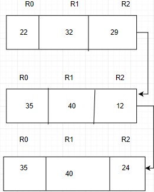

## Ανάπτυξη Λογισμικού για Πληροφοριακά Συστήματα (Κ23α)

Θεόφιλος Κανταρτζής 1115201400
Σκούρας Γιώργος 1115201400309

### Τελική Αναφορά

Στην εργασία αυτή καλούμαστε να υλοποιήσουμε τον αλγόριθμο ζεύξης πινάκων Sort Merge Join . Στόχος είναι να πραγματοποιείται ζεύξη μεταξύ δύο σχέσεων αφου πρώτα τα δεδομένα της κάθε σχέσης έχουν ταξινομηθεί. 

### Μεταγλώτιση και εκτέλεση

#### Mεταγλώτιση

 ```bash
make
```
#### Εκτέλεση

```bash
./EXEC/sort_join
```

### Περιγραφή λειτουργικότητας
 

 #### Αποθήκευεση Δεδομένων

* Διαβάζουμε το αρχείο με τις σχέσεις και το αποθηκεύουμε στη δομή all_data που είναι ένας πίνακας με δείκτες στη δομή relation_data. Κάθε relation_data έχει δείκτες στην αρχή κάθε coloumn τη σχέσης. Κάθε φορά που διαβάζουμε νέα σχέση η δομή all_data επεκτείνεται κατά 1. 
Για κάθε σχέση αποθηκεύουμε τις πληροφορίες l, u ,f, d  που ζητούνται. Η τιμη l αναφέρεται στην μικρότερη τιμή της εκάστοτε στήλης . Η τιμή u αναφέρεται στην μεγαλύτερη τιμή, η τιμή f αναφέρεται στο πλήθος των δεδομένων της και τέλος η τιμή d πλήθος των μοναδικών τιμών της.
Όταν ο χρήστης πατήσει "Done" τελειώνει και η ανάγνωση τον σχέσεων.

* Το αρχείο με τα Queries αποθηκεύεται στη δομή Batches η οποία κρατάει όλα τα Batches και έχει δείκτες στη δομή Batch_lines που εκεί κρατάμε κάθε query ξεχωριστά.

* Οι σχέσεις, τα κατηγορήματα και οι προβολές αποθηκεύονται σε ξεχωριστές δομές (predicates, check sums) όπου έκει κρατάμε και τις πληροφορίες που χρειάζονται κάθε φορά, όπως το σε ποιά σχέση αναφερόμαστε κάθε φορά(rel_origin) και ποια είναι η αντίστοιχή της στο ερώτημα(rel_alias).

* Ύστερα δημιουργούμε τον Job Scheduler. Ο JS είναι μια λίστα με τη λογική μιας ουράς αναμονής. Κάθε κόμβος της λίστας περιέχει δείκτες σε query_jobs, join jobs ή sort_jobs. Κάθε φορά που διαβάζουμε ένα καινύργιο Query αυτό γίνεται push στον Job Scheduler. Μόλις ολοκληρωθεί ένα batch, threads που τα ορίζουμε με #define MAX THREADS αναλαμBανουνε την παράλληλη εκτέλεση των Queries. Οταν ολοκληρώνεται κάποιο Query βάζει το αποτέλεσμά του στην κατάλληλη θέση ενός πίνακα, δηλαδή αν πρώτο τελείωσε το Query 3 θα βάλει το αποτέλεσμά του στη θέση 3. Οταν η λίστα του Job Scheduler αδειάσει σημαίνει ότι το Batch ολοκληρώθηκε οπότε απλα εκτυπώνουμε τα αποτελέσματα του πίνακα σειριακά. 


#### Εκτέλεση Ερωτημάτων

 * Αρχικά εκτελούνται τα φίλτρα των ερωτημάτων για να μειωθεί το μέγεθος των πινάκων. Τα rowid των σχέσεων που φιλτράρονται αποθηκεύονται στη δομή Between, στον πίνακα farrays
 
 * Αντίστοιχα στην ίδια δομή, κρατάμε ένα δείκτη στην δομή result_list που είναι μια λίστα που κρατάει τα ενδιάμεσα αποτελέσματα που προκύπτουν απο τις ζεύξης μεταξύ των σχέσεων. Κάθε κόμβος της λίστας είναι ένας πίνακας από ακεραίους που κρατάνε τα rowid των σχέσεων που γίνονται join . Ο πίνακας έχει τόσες θέσεις όσες ο αριθμός των relations.
 
  .
 
 * Πριν γίνει κάθε join καλούμε την συνάρτηση prepare_relation() η οποία αναλαμβάνει να ταξινομήσει την εκάστοτε σχέση. Ανάλογα με το αν αυτή η σχέση έχει φιλτραριστεί ή έχει γίνει join,  επιλέγουμε θα πάρουμε τα δεδομένα της από τον αρχικό πίνακα ή απο την δομή των ενδιάμεσων αποτελεσμάτων. 
 
 * Κατα την εκτέλεση του πρώτου join σε κάθε query γεμίζουμε την λίστα με την συνάρτηση result_list_fill_empty(), ενώ αν έχει πραγματοποιηθεί ήδη κάποιο join καλούμε την συνάρτηση result_list_update() ώστε να ανανεώσουμε την λίστα με τα καινούργια αποτελέσματα.
    
 * Αν έχουν συμμετάσχει δύο σχέσεις σε κάποια ζεύξη και στη συνέχεια ξαναζητηθούν τότε η εκάστοτε ζεύξη εκτελείται ως φίλτρο. Ακόμη αν μια σχέση ζητηθεί δυό φορες τότε γίνεται τα join με εκείνη τη σχέση πρώτα για να εκμεταλευτούμε το γεγονός ότι η σχέση αυτή θα είναι ήδη ταξινομημένη.
 
 * Κάθε φορά που γίνεται κάποιο join τα στατιστικά των σχέσεων που συμμετήχανε ανανεωόνονται μέσω της Update Statistics.

#### Έλεγχος αθροισμάτων

* Στην συνάρτηση print_check_sums() αναλόγως τις προβολές του κάθε ερωτήματος απλά  αθροιζουμε τα payloads μόνο τον keys που περιέχονται στη λίστα. 

### Χρόνοι Εκτέλεσης


